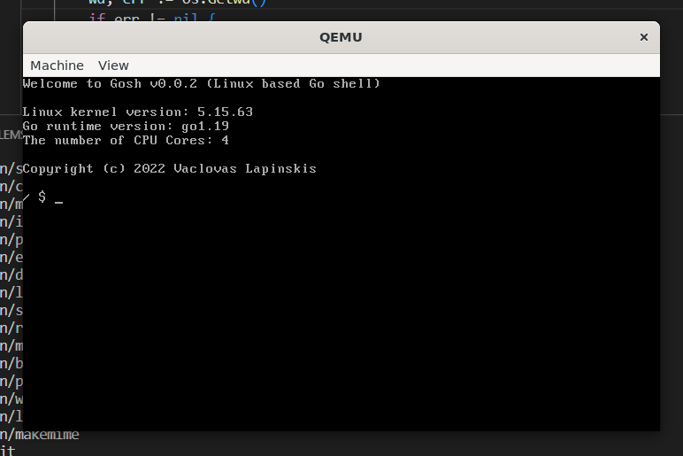

# Gosh (go-powered bash)

Bash written in Go



You can install QEMU on your Ubuntu machine using the APT package manager. Fire up the terminal and issue the following command to install QEMU on Ubuntu:
```sh
sudo apt install qemu-kvm -y
```

Start qemu with command:
```sh
 qemu-system-x86_64 -kernel bzImage -initrd initramfs.cpio.gz -smp 4 -m 1024
```